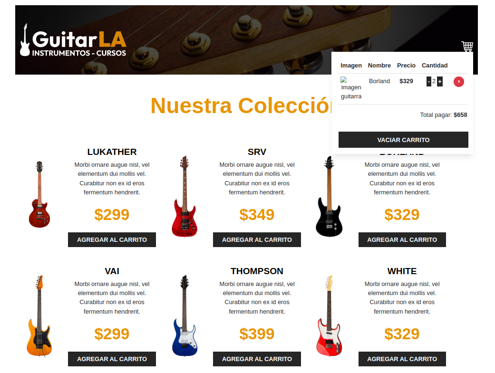

# 🛒 Ecommerce con React + TypeScript + Vite

Un proyecto base de ecommerce construido con **React**, **TypeScript**, y **Vite**, utilizando **useReducer** para manejar el estado global del carrito de compras.

---


## 🚀 Tecnologías utilizadas

- ⚛️ **React 18**
- 💙 **TypeScript**
- ⚡ **Vite**
- 🧩 **useReducer** para la gestión del carrito
- 🎨 tailwincss para los estilos base

---

## 🧠 Descripción

Este proyecto simula una tienda online donde los usuarios pueden:

- Ver una lista de productos (por ejemplo, guitarras 🎸)  
- Agregar o eliminar productos del carrito  
- Aumentar o disminuir cantidades  
- Vaciar el carrito completo  
- Ver el total calculado dinámicamente

El estado del carrito se maneja con **useReducer**, lo que permite una lógica clara y escalable para manejar acciones como `ADD_TO_CART`, `REMOVE_FROM_CART`, `INCREASE_QUANTITY`, etc.

---

## 🏗️ Estructura del proyecto
```
src/
├── components/
│ ├── Header.tsx
│ ├── Guitar.tsx
│ └── Cart.tsx
├── hooks/
│ └── useCart.ts
├── reducers/
│ └── cart-reducer.ts
├── App.tsx
├── main.tsx
└── index.css
```
---
## Próximas mejoras

Conexión a una API real de productos

Persistencia del carrito en localStorage

Integración con pasarela de pagos

Filtros y categorías dinámicas

